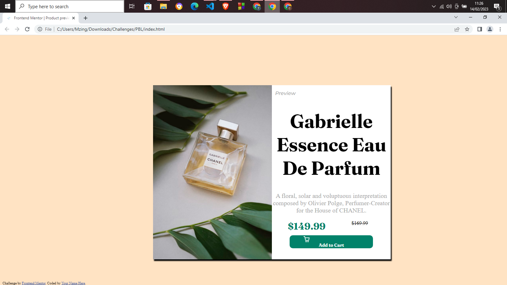

# Frontend Mentor - Product preview card component solution

This is a solution to the [Product preview card component challenge on Frontend Mentor](https://www.frontendmentor.io/challenges/product-preview-card-component-GO7UmttRfa). Frontend Mentor challenges help you improve your coding skills by building realistic projects. 

## Table of contents

- [Overview](#overview)
  - [The challenge](#the-challenge)
  - [Screenshot](#screenshot)
  - [Links](#links)
- [My process](#my-process)
  - [Built with](#built-with)
  - [What I learned](#what-i-learned)
  - [Continued development](#continued-development)
  - [Useful resources](#useful-resources)
- [Author](#author)
- [Acknowledgments](#acknowledgments)

**Note: Delete this note and update the table of contents based on what sections you keep.**

## Overview

### The challenge

Users should be able to:

- View the optimal layout depending on their device's screen size
- See hover and focus states for interactive elements

### Screenshot



This is a screenshot of my solution. I havent been working on CSS for a while now so I didn't make it that perfect :)

### Links

- Solution URL: [Add solution URL here](https://your-solution-url.com)
- Live Site URL: [Add live site URL here](https://your-live-site-url.com)

## My process

### Built with

- Semantic HTML5 markup
- CSS custom properties
- Flexbox
- CSS Grid
- Mobile-first workflow


### What I learned

In this project I learnt on CSS grid, some styling methods and responsiveness.


```html
<h1>Some HTML code I'm proud of</h1>
```
```css
.proud-of-this-css {
  color: papayawhip;
}
```
```js
const proudOfThisFunc = () => {
  console.log('🎉')
}
```


### Continued development

I want to focus on learning responsiveness and making good UI/UX. I'm planning to learn preloarders then bootstrap in order to make better and more responsive webpages


### Useful resources

- [Example resource 1](https://www.freecodecamp.com) - This helped me for CSS grid reason. I really liked the way they teach and their style of styling CSS. Moving forward I will be using it to learn new concepts.
- [Example resource 2](https://www.javatpoint.com) - This is an amazing article which helped me finally understand Grid and flexbox. I'd recommend it to anyone still learning this concept.


## Author

- Website - [clevesfolio.hstn.me](http://www.clevesfolio.hstn.me)
- Frontend Mentor - [@Cleve-codes](https://www.frontendmentor.io/profile/cleve-codes)
- Twitter - [@Cleve=codes](https://www.twitter.com/cleve-codes)


